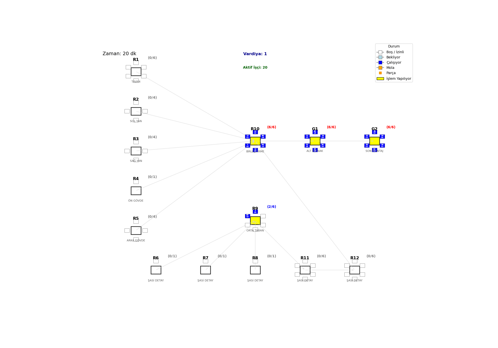
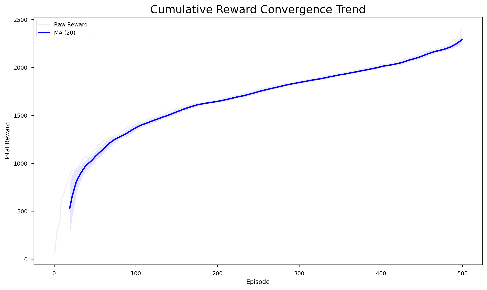
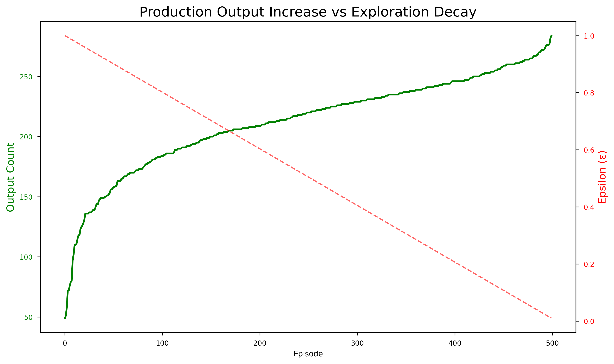
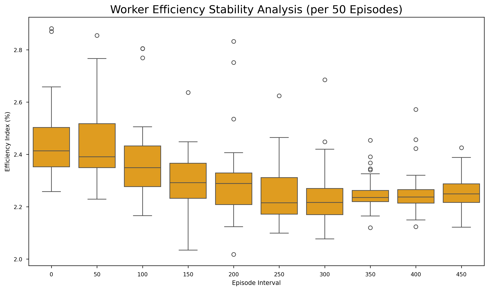

# 🏭 Yapay Zeka Destekli Hibrit Montaj Hattı Dengeleme (D3QN)



## 🚀 Proje Özeti
Bu proje, bir otobüs üretim fabrikasının **Dijital İkizini** (Digital Twin) oluşturarak, üretim hattındaki işçi atamalarını ve hat dengelemesini **Double Dueling Deep Q-Network (D3QN)** ajanı ile optimize etmektedir. Geleneksel statik yöntemlerin aksine, yapay zeka ajanımız dinamik bir "Süpervizör" gibi çalışarak; işçilerin yorgunluk seviyelerini, yetkinliklerini (1-5 seviye) ve anlık darboğazları analiz eder ve en uygun atamayı gerçekleştirir.

Sistem, fiziksel ortamı modellemek için **SimPy (Ayrık Olay Simülasyonu)** ve karar mekanizması için **PyTorch (Derin Pekiştirmeli Öğrenme)** kütüphanelerini hibrit bir yapıda kullanır.

---

## 🧠 Temel Özellikler

| Özellik | Açıklama |
| :--- | :--- |
| **🤖 D3QN Ajanı** | Double & Dueling mimarisi ile kararlı ve hızlı öğrenen yapay zeka modeli. |
| **🏭 Dijital İkiz** | 14 istasyon (R1-R12, G1-G2) ve 46 işçiden oluşan gerçekçi fabrika simülasyonu. |
| **⚡ Yorgunluk Modeli** | **Jaber & Neumann (2010)** logaritmik yorgunluk ve dinlenme modelleri entegre edilmiştir. |
| **🎓 Yetkinlik Matrisi** | Her işçi için 1'den 5'e kadar (Çırak -> Usta) tanımlanmış polivalans tablosu. |
| **📊 Gerçek Zamanlı Analiz** | Üretim adedi, verimlilik, darboğaz ve işçi doluluk oranlarının anlık takibi. |

---

## 🏗️ Sistem Mimarisi

Ajan, SimPy ortamından gelen durum vektörünü (State) okur ve ödül fonksiyonunu (Reward) maksimize edecek aksiyonu (Action) seçer.


### Fabrika Yerleşimi
Üretim hattı; şasi hazırlık (R1-R8), gövde çatma (R9-R10) ve son montaj (G1-G2) aşamalarından oluşur.


---

## 📈 Sonuçlar ve Performans

Model, **TÜBİTAK TRUBA** (Hamsi kümesi, 56 CPU) altyapısında 500 epizot boyunca eğitilmiştir.

### 1. Öğrenme Başarısı (Convergence)
Ajan, yaklaşık 350. epizottan itibaren fabrika dinamiklerini çözerek optimum stratejiye ulaşmıştır.



### 2. Üretim Artışı
Eğitimin başında (Rastgele/Keşif fazı) aylık 140 olan üretim, yapay zeka devreye girdiğinde **266 adede** çıkmıştır.



### 3. İş Yükü Dengesi
Ajan, işçileri sadece gerektiğinde çalıştırarak (Kısıtlar Teorisi - TOC), yorgunluğu minimize etmiş ve hat dengesini korumuştur.



---

## 🛠️ Kurulum ve Kullanım

### Gereksinimler
*   Python 3.8+
*   PyTorch
*   SimPy
*   Gymnasium
*   Pandas & NumPy

### Kurulum
```bash
git clone https://github.com/kullanici-adiniz/dqn-product-line.git
cd dqn-product-line
pip install -r requirements.txt
```

### Eğitim (Training)
D3QN ajanını sıfırdan eğitmek için:
```bash
python train.py --episodes 500
```

### Görselleştirme
Simülasyonu GIF olarak kaydetmek için:
```bash
python generate_academic_gif.py
```

---

## 📂 Proje Yapısı

```
├── agent.py              # D3QN Ajanı ve Replay Buffer Kodları
├── factory_env.py        # Gymnasium Uyumlu Fabrika Ortamı
├── simulation.py         # SimPy Tabanlı Simülasyon Motoru
├── train.py              # Ana Eğitim Döngüsü
├── config.py             # Hiperparametreler ve Ayarlar
├── data/                 # İşçi Yetkinlikleri ve Malzeme Listesi (BOM)
└── logs/                 # Eğitim Kayıtları ve Grafikler
```

---

## 📜 Atıf (Citation)
Bu çalışmayı akademik araştırmalarınızda kullanırsanız lütfen şu şekilde atıf yapınız:

> **Yapay Zeka Destekli Hibrit Montaj Hattı Dengeleme ve Dinamik İşçi Atama Sistemi: Derin Pekiştirmeli Öğrenme Yaklaşımı**

---

*Powered by PyTorch, SimPy, and Coffee ☕*
